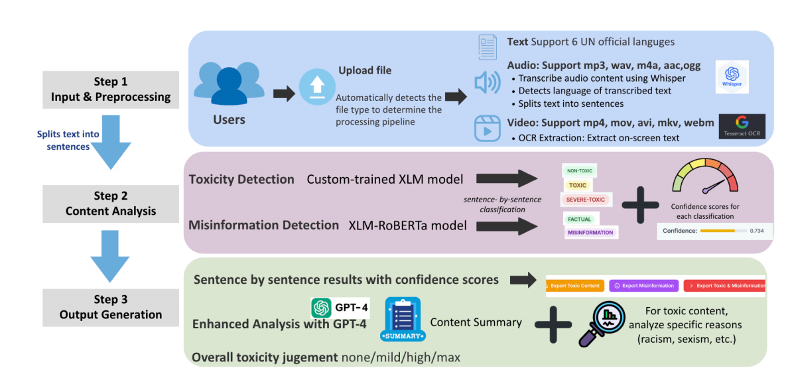
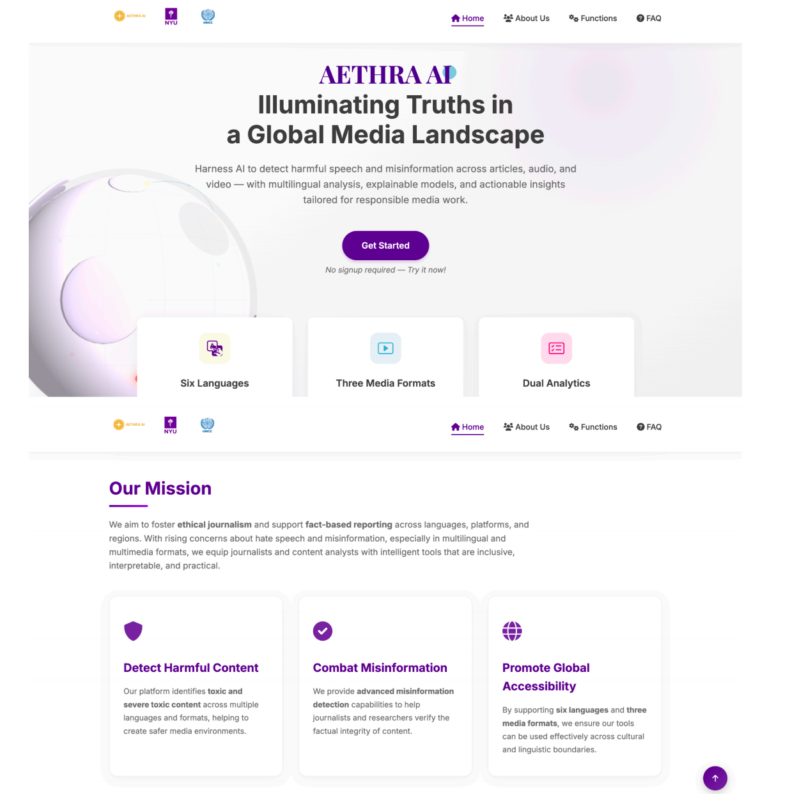
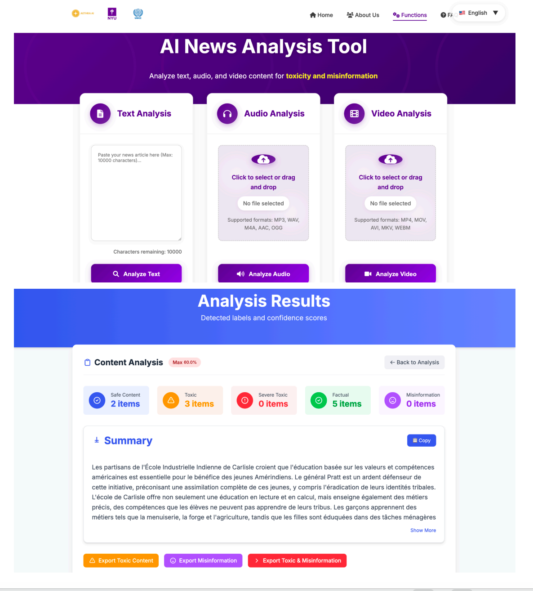
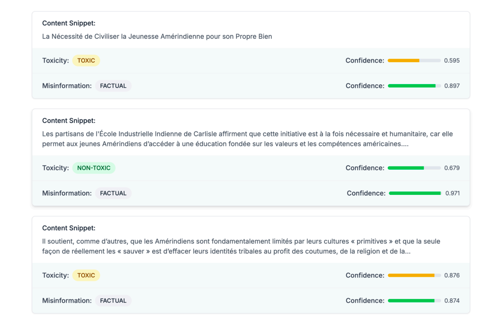

# AETHRA AI-— Multilingual & Multimodal Media project
2025 graduation project for my team own

### Multilingual & Multimodal AI Media Analysis Tool

AETHRA AI is an AI-powered media analysis platform developed as part of an NYU Applied Project sponsored by the **United Nations International Computing Centre (UNICC)**.

The platform is designed to help journalists and media professionals detect **xenophobic language, misinformation, and harmful narratives** across **text, audio, and video content**.

It supports all **six official United Nations languages**:

**Arabic · Chinese · English · French · Russian · Spanish**

---

## 🎬 Demo

[▶ Watch the Demo Video](YOUR_DEMO_VIDEO_LINK)

> (https://drive.google.com/file/d/17Yy2Qjp8h1Qa45oEBTx10VHrNzHNGzLy/view?usp=drive_link)

---

## 📌 Project Overview

Media coverage of migration, refugees, and displaced populations can contain explicit or subtle xenophobic language, misinformation, and harmful stereotypes.

Manual content review is often:

- Time-consuming
- Difficult to scale
- Inconsistent across languages
- Limited when processing audio and video
- Less effective at identifying subtle or context-dependent harmful narratives

AETHRA AI addresses these challenges through an integrated **multilingual and multimodal AI pipeline** that analyzes journalistic content and provides actionable feedback before publication.

The system can:

- Detect potentially toxic or xenophobic content
- Detect possible misinformation
- Generate confidence scores
- Analyze content sentence by sentence
- Provide explanations for flagged content
- Generate content summaries
- Support text, audio, and video inputs

---

## ✨ Key Features

### 🌍 Multilingual Analysis

Supports all six official UN languages:

- Arabic
- Chinese
- English
- French
- Russian
- Spanish

The system uses multilingual transformer models to analyze content across different linguistic environments.

### 📝 Text Analysis

Users can directly submit written content for sentence
